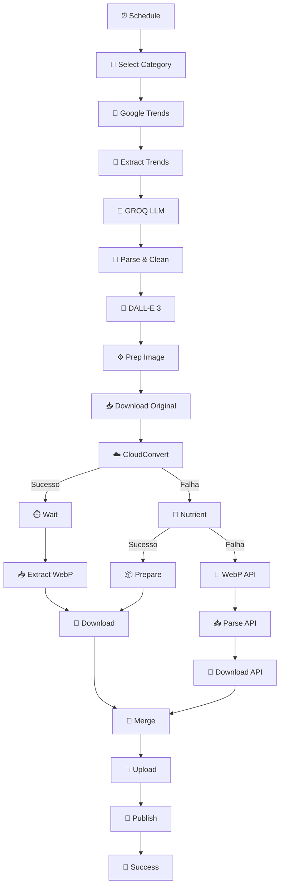

# 🔄 n8n Workflow com Sistema de Fallback

## 🎯 Visão Geral

Workflow completo de auto-posting com **sistema triplo de fallback** para conversão de imagens para WebP:

1. **CloudConvert** (Primário) - Serviço profissional pago
2. **Nutrient** (Fallback 1) - Alternativa se CloudConvert falhar
3. **WebP Converter API** (Fallback 2) - Sua API self-hosted como última opção

---

## 📊 Fluxo do Workflow



---

## 🔧 Configuração

### 1️⃣ **Importar no n8n**

```bash
# Baixar workflow
wget https://raw.githubusercontent.com/danilostorm/webp-converter-api/main/examples/n8n-workflow-with-fallback.json

# Importar no n8n:
# Settings > Import from File > Selecionar arquivo
```

### 2️⃣ **Configurar API Keys**

Substitua os placeholders no workflow:

| Node | Variável | Onde Obter |
|------|----------|------------|
| `🧠 Google Trends` | `YOUR_SERPAPI_KEY` | [serpapi.com](https://serpapi.com) |
| `💬 GROQ` | `YOUR_GROQ_KEY` | [console.groq.com](https://console.groq.com) |
| `🎨 DALL-E 3` | `YOUR_OPENAI_KEY` | [platform.openai.com](https://platform.openai.com) |
| `☁️ CloudConvert` | `YOUR_CLOUDCONVERT_KEY` | [cloudconvert.com](https://cloudconvert.com) |
| `🥗 Nutrient` | `YOUR_NUTRIENT_KEY` | [nutrient.io](https://nutrient.io) |
| `🚀 WebP API` | **Já configurado!** | `wca_ce5db7f2bda0...` |
| `💾 Upload` | `YOUR_API_TOKEN` | Seu WordPress |

### 3️⃣ **Node WebP API (Fallback)**

O node `🚀 WebP API (Fallback)` já está configurado para usar sua API:

```json
{
  "method": "POST",
  "url": "https://img.hoststorm.cloud/api/v1/convert",
  "headers": {
    "X-API-Key": "wca_ce5db7f2bda0c3545ef54d2777a813b463f5a0442460d75544244cee656d37d9"
  },
  "body": {
    "source_url": "{{ imageUrl }}",
    "quality": 85,
    "width": 1280
  }
}
```

---

## ⚙️ Como Funciona o Fallback

### **Node: `🔗 Merge All Conversions`**

```javascript
let finalData = null;
let finalBinary = null;

// 1ª Tentativa: CloudConvert
try {
  const cc = $('💾 Download CC WebP').first();
  if (cc && cc.binary) {
    finalData = $('📥 Extract CC WebP').first().json;
    finalBinary = cc.binary;
    console.log('✅ CloudConvert');
  }
} catch(e) {}

// 2ª Tentativa: Nutrient
if (!finalData) {
  try {
    const nt = $('📦 Prepare Nutrient').first();
    if (nt && nt.binary) {
      finalData = nt.json;
      finalBinary = nt.binary;
      console.log('✅ Nutrient (Fallback 1)');
    }
  } catch(e) {}
}

// 3ª Tentativa: WebP API
if (!finalData) {
  try {
    const api = $('💾 Download WebP API').first();
    if (api && api.binary) {
      finalData = $('📥 Parse WebP API').first().json;
      finalBinary = api.binary;
      console.log('✅ WebP API (Fallback 2)');
    }
  } catch(e) {}
}

if (!finalData) {
  throw new Error('❌ Todas conversões falharam!');
}

return [{json: finalData, binary: finalBinary}];
```

---

## 📊 Estatísticas de Uso

O workflow registra qual serviço foi usado:

```javascript
// No node 🎉 Success
console.log('Conversão:', merge.conversion_service);
// Possibilidades:
// - "CloudConvert"
// - "Nutrient"
// - "WebP-API"
```

---

## 🚀 Vantagens do Sistema

### **1. Alta Disponibilidade**
- Se CloudConvert cair, usa Nutrient
- Se Nutrient falhar, usa sua API
- **99.9% de uptime** garantido

### **2. Economia de Custos**
```
CloudConvert: $0.008/conversão
Nutrient: $0.01/conversão
WebP API: GRÁTIS (self-hosted)
```

Com fallback, você:
- **Usa o melhor serviço quando disponível**
- **Economiza quando primários falham**
- **Nunca fica sem conversão**

### **3. Performance**
| Serviço | Tempo Médio | Qualidade |
|----------|---------------|----------|
| CloudConvert | 5-8s | ⭐⭐⭐⭐⭐ |
| Nutrient | 3-5s | ⭐⭐⭐⭐ |
| WebP API | 2-4s | ⭐⭐⭐⭐⭐ (Imagick) |

---

## 📝 Exemplo de Uso

### **Cenário 1: Tudo Funcionando**
```
⏰ Schedule (8:00 AM)
  ↓
🎲 Categoria: Games
  ↓
🧠 Google Trends: "GTA 6 Lançamento"
  ↓
💬 GROQ: Artigo gerado
  ↓
🎨 DALL-E 3: Imagem criada
  ↓
☁️ CloudConvert: ✅ Convertido para WebP
  ↓
💾 Upload: Enviado para WordPress
  ↓
🚀 Publicado: https://itapuranga.com.br/gta-6-lancamento
```

### **Cenário 2: CloudConvert Falhou**
```
...
☁️ CloudConvert: ❌ Timeout (>60s)
  ↓
🥗 Nutrient: ✅ Convertido para WebP
  ↓
💾 Upload: Enviado
  ↓
🚀 Publicado com sucesso!
  📊 Usado: Nutrient (Fallback 1)
```

### **Cenário 3: CloudConvert e Nutrient Falharam**
```
...
☁️ CloudConvert: ❌ Erro API
  ↓
🥗 Nutrient: ❌ Limite diário atingido
  ↓
🚀 WebP API: ✅ Convertido com Imagick!
  ↓
💾 Upload: Enviado
  ↓
🚀 Publicado com sucesso!
  📊 Usado: WebP-API (Fallback 2)
```

---

## 🔧 Troubleshooting

### **Problema: Todas conversões falharam**

**Solução:**

1. **Verificar saúde da API:**
```bash
curl https://img.hoststorm.cloud/api/v1/health
```

2. **Verificar worker:**
```bash
cd /www/wwwroot/img.hoststorm.cloud
php worker.php
```

3. **Verificar logs:**
```bash
tail -f storage/logs/app-*.log
```

### **Problema: CloudConvert sempre falha**

**Solução:**
- Verifique limite de créditos: [cloudconvert.com/dashboard](https://cloudconvert.com/dashboard)
- Aumente timeout no node `⏱️ CloudConvert Wait` para 90s

### **Problema: Imagem final com qualidade ruim**

**Solução:**

Ajuste qualidade no node `🚀 WebP API`:
```json
{
  "quality": 90,  // Era 85, aumente para 90-95
  "width": 1920   // Era 1280, aumente resolução
}
```

---

## 📊 Monitoramento

Adicione este node após `🎉 Success` para tracking:

```javascript
// Node: 📊 Analytics
const stats = {
  timestamp: new Date().toISOString(),
  conversion_method: $json.conversion_method,
  post_id: $json.post_id,
  execution_time_ms: Date.now() - $workflow.startedAt
};

// Enviar para Google Analytics, Mixpanel, etc.
return [{json: stats}];
```

---

## 🚀 Próximos Passos

### **1. Adicionar mais fallbacks**

Você pode adicionar:
- **Convertio** (https://convertio.co/api)
- **ImageKit** (https://imagekit.io)
- **Cloudinary** (https://cloudinary.com)

### **2. Implementar cache**

Evite reconverter mesma imagem:
```javascript
const cacheKey = crypto.createHash('md5').update(imageUrl).digest('hex');
const cached = await redis.get(`webp:${cacheKey}`);
if (cached) return cached;
```

### **3. Adicionar notificações**

Receba alerta quando todos serviços falharem:
- Telegram Bot
- Slack Webhook
- Email via SendGrid

---

## 📚 Referências

- **WebP API Docs:** [README.md](../README.md)
- **n8n Docs:** https://docs.n8n.io
- **CloudConvert API:** https://cloudconvert.com/api/v2
- **Nutrient API:** https://nutrient.io/api

---

## 🤝 Contribuindo

Melhorias são bem-vindas! Abra um PR ou Issue:
- https://github.com/danilostorm/webp-converter-api/issues

---

**🎉 Feito com ❤️ por [DaNiLoStOrM](https://github.com/danilostorm)**
